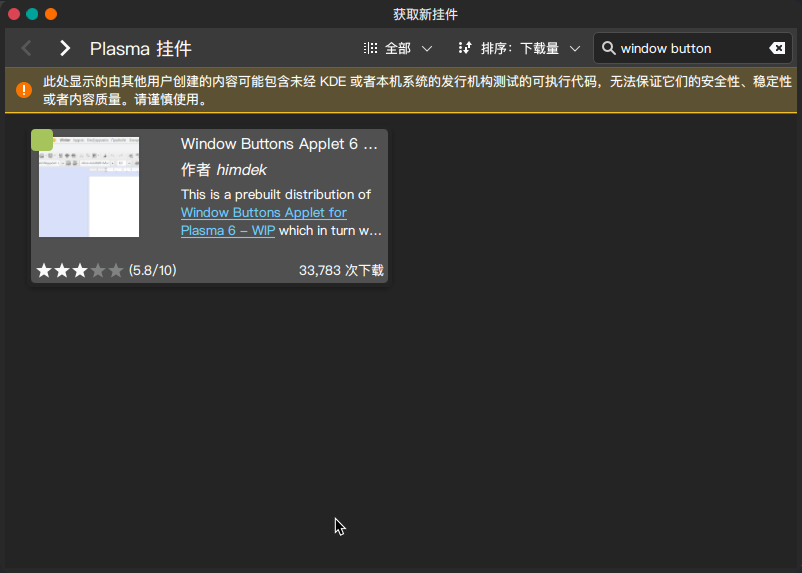

# <p style="text-align:center">`Manjaro` 指南</p>

## 一、安装

1.创建 U 盘 `ISO` 镜像

镜像下载地址: `https://manjaro.org/download/`

* 务必使用 `DD` 模式刻录

2.安装

`yay -S ventoy`

3.安装分区方案

| File System | File System Label | Mount Point |   Size(MB)   |
| :---------: | :---------------: | :---------: | :----------: |
|    swap     |       swap        |      -      |     8192     |
|    ext4     |       boot        |    /boot    |     2048     |
|    FAT32    |        efi        |  /boot/efi  |     300      |
|    ext4     |       root        |      /      |  81920(80G)  |
|    ext4     |        usr        |    /usr     | 122880(120G) |
|    ext4     |       home        |    /home    |   剩余全部   |

## 二、常用软件安装

### (一)、系统更新和软件源设置

#### 1.更新系统

`sudo pacman -Syyu`

#### 2.使用国内的软件源

`sudo pacman-mirrors -i -c China -m rank`

#### 3.添加 `Archlinux` 中文社区仓库

使用 `vi` 命令在 `/etc/pacman.conf` 文件末尾添加一下两行:

```conf
[archlinuxcn]
SigLevel = Optional TrustedOnly
# 清华大学的软件源
Server = https://mirrors.ustc.edu.cn/archlinuxcn/$arch
```

更新 `GPG` 签名

`sudo pacman -Sy archlinuxcn-keyring && sudo pacman -Su`

### (二)、输入法设置

#### ~~1.`fcitx4` 输入法~~

处于这个段位的输入法有：`搜狗输入法`、`谷歌输入法`、`讯飞输入法` 等

* `fcitx4` 已停止维护

#### 2.⭐`fcitx5`输入法

处于这个段位的输入法：`小鹤双拼`、`云拼音`、`双拼`、`rime`

* `fcitx5`新输入法框架，不受谷歌，搜狗的支持

##### (1).基本配置使用
> 所有通过`fcitx5`支持的输入法,都是这个配置步骤
>
> 安装`manjaro-asian-input-support`
> fcitx5: `yay -S fcitx5-input-support`

###### 1)安装命令

```shell
sudo pacman -Syy fcitx5 fcitx5-configtool fcitx5-qt fcitx5-gtk fcitx5-chinese-addons fcitx5-material-color kcm-fcitx5 fcitx5-lua
```

###### 2)设置环境变量

通过 `vi` 编辑器编辑环境变量文件 `/etc/environment`

`sudo vi /etc/environment`

将以下内容保存

```shell
GTK_IM_MODULE=fcitx
QT_IM_MODULE=fcitx
XMODIFIERS=@im=fcitx
```

重启电脑

###### 3)配置输入法
* KDE 6以下

打开**系统设置**-->**个性化**-->**语言和区域设置**-->**输入法**-->**添加输入法**

* KDE 6

打开**系统设置**-->**输入法**-->**添加输入法**

##### (2).输入法皮肤
> 输入法皮肤不区分`小鹤双拼`、`云拼音`、`双拼`、`rime`等具体的输入法支持,`fcitx5`下通用

使用方法:

1> 执行命令安装输入法

2> 打开**设置**-->**输入法**-->**配置附加组件**-->**经典用户界面**

3> 修改**主题**设置亮色皮肤

4> 修改**深色主题**设置暗色皮肤

> 这个界面的其他设置项，根据需要修改

###### 1)烛光皮肤

* 源码: https://github.com/thep0y/fcitx5-themes-candlelight

* 安装: `yay -S fcitx5-themes-candlelight`

* 预览:


###### 2)`Material-Color`仿Win10
* 源码: https://github.com/hosxy/Fcitx5-Material-Color

* 安装: `yay -S pacman -S fcitx5-material-color`

* 预览:


##### (3).⭐`rime` + 雾凇输入法
###### 1)`rime`
> rime是一个输入法引擎，支持各个平台
> 官网: https://rime.im/

|  平台   | 适配框架                                                     | 适配方案                |
| :-----: | ------------------------------------------------------------ | ----------------------- |
|  Linux  | [中州韵](https://github.com/fcitx/fcitx5-rime)               | 支持`IBus`和`Fcitx`运行 |
| Windows | [小狼毫](https://github.com/rime/weasel)                     | `rime`本身              |
|  Macos  | [鼠须管](https://github.com/rime/squirrel)和[小企鹅输入法](https://github.com/fcitx-contrib/fcitx5-macos-installer/blob/master/README.zh-CN.md) | 小企鹅通过`Fcitx`运行   |
| Android | [同文输入法](https://github.com/osfans/trime/blob/develop/README_sc.md)和小企鹅 | `TRIME`                 |
|   iOS   | [仓输入法](https://apps.apple.com/cn/app/仓输入法/id6446617683?l=en-GB)（开源免费）、[iRime](https://apps.apple.com/cn/app/irime输入法-小鹤双拼五笔郑码输入法/id1142623977)（付费） |                         |


> 以上表格整理自: https://rime.im/download/
>
> ⚠️目前Linux下最好的输入法就是`rime` + 雾凇输入法的组合，搜狗输入法会导致系统卡死，其他输入法都体验不佳或迭代太慢

* 安装`rime`: `sudo pacman -Sy fcitx5-rime`

* 启动: **设置**-->**输入法**-->**添加输入法**-->选择**rime**或**中州韵**

###### 2)雾凇输入法
* 官网: https://dvel.me/posts/rime-ice/

* 源码: https://github.com/iDvel/rime-ice

* 安装:

|                            软件包                            |                    命令                     |
| :----------------------------------------------------------: | :-----------------------------------------: |
| [雾凇拼音](https://aur.archlinux.org/packages/rime-ice-pinyin-git) |        `yay -S rime-ice-pinyin-git`         |
| [自然码双拼](https://aur.archlinux.org/packages/rime-ice-double-pinyin-git) |     `yay -S rime-ice-double-pinyin-git`     |
| [小鹤双拼](https://aur.archlinux.org/packages/rime-ice-double-pinyin-flypy-git) |  `yay -S rime-ice-double-pinyin-flypy-git`  |
| [微软双拼](https://aur.archlinux.org/packages/rime-ice-double-pinyin-mspy-git) |  `yay -S rime-ice-double-pinyin-mspy-git`   |
| [智能 ABC 双拼](https://aur.archlinux.org/packages/rime-ice-double-pinyin-abc-git) |   `yay -S rime-ice-double-pinyin-abc-git`   |
| [紫光双拼](https://aur.archlinux.org/packages/rime-ice-double-pinyin-ziguang-git) | `yay -S rime-ice-double-pinyin-ziguang-git` |

* 配置

创建文件`$HOME/.local/share/fcitx5/rime/default.custom.yaml`

```yaml
patch:
  # 仅使用「雾凇拼音」的默认配置，配置此行即可
  __include: rime_ice_suggestion:/
  # 以下根据自己所需自行定义，仅做参考。
  # 针对对应处方的定制条目，请使用 <recipe>.custom.yaml 中配置，例如 rime_ice.custom.yaml
  __patch:
    key_binder/bindings/+:
      # 开启逗号句号翻页
      - { when: paging, accept: comma, send: Page_Up }
      - { when: has_menu, accept: period, send: Page_Down }
```

##### (4).输入法词库
###### 1) 自建拼音词库
* 源码: https://github.com/wuhgit/CustomPinyinDictionary

* 安装: `yay -S fcitx5-pinyin-custom-pinyin-dictionary`

###### 2) ⭐搜狗词库
* 源码: https://github.com/maoyaotang12/sougouscel

* 安装: `yay -S fcitx5-pinyin-sougou-dict`

### (三)、常用软件安装

#### 1.软件

```shell
安装 vim
sudo pacman -S --noconfirm vim
# 安装网络基础工具 ifconfig 命令等
sudo pacman -S --noconfirm net-tools git-zsh-completion libappindicator-gtk3 gvfs
```

#### 2.`AUR` 软件仓库支持

`pacman` 自带的软件是非常少的，`AUR` 中有大量可用的软件

安装 `yay` 工具

`sudo pacman -S yay base-devel --noconfirm`

后续软件命令

安装: `yay -S XXX`

同步更新软件: `yay -Syyu`

卸载软件等同 `pacman`

#### 3.基本软件安装

```shell
# 中文字体支持，安装后设置中选择 noto-cjk
sudo pacman -S noto-fonts-cjk noto-fonts-extra

# 等宽中文 更纱黑体
yay -S ttf-sarasa-gothic-sc

# 安装谷歌浏览器、sublime-text、switchhosts、apifox、linux 版钉钉
yay -S --noconfirm google-chrome sublime-text switchhosts-appimage apifox linuxqq dingtalk-bin

# 安装 redis 工具 vscode、福昕阅读器
yay -S --noconfirm visual-studio-code-bin foxitreader

# du命令的替代品
sudo pacman -S ncdu gdu

# top的替代品
sudo pacman -S htop

# ls的替代品
sudo pacman -S exa

# df的替代品
sudo pacman -S duf

# vim的替代品
sudo pacman -S neovim
```

#### 4.应用程序启动器

`yay -S ulauncher`

#### 5.截图软件

> 录制 gif 图 `sudo pacman -S peek`

##### (1).`flameshot`

`sudo pacman -S --noconfirm flameshot`

##### (1).⭐`snipaste`

`yay -S snipaste`

#### 6.`pacman`和`AUR`配置

##### (1).`pacman`

###### 1>配置文件
* 位置: `/etc/pacman.conf`

<a href="./config/pacman.conf.ini">通用`pacman.conf`文件</a>

###### 2>自动清理软件包目录
> 默认软件包保存在`/var/cache/pacman/pkg/`,`pacman`不会自动清理它，会造成目录越来越大<br/>
> 有作者参考`yaycache-hook`,制作了`paccache-hook`

* 安装: `yay -S paccache-hook`
* 配置: `/etc/paccache-hook.conf`
> 默认对已安装的软件包保留2个版本, 不保留卸载的软件包,可根据需要修改配置，在每次执行`pacman`命令安装卸载后自动执行

##### (2).`yay`
###### 1>配置文件
* 位置: `~/.config/yay/config.json`

<a href="./config/yay-config.json">通用`config.json`文件</a>

###### 2>自动清理软件包目录
> 默认软件包保存在`~/.cache/yay`,`yay`不会自动清理它，会造成目录越来越大
> 有作者参考`paccache`,制作了`yaycache`

* 安装: `yay -S yaycache-hook`
* 配置: `/etc/yaycache-hook.conf`
* 源码: https://github.com/aokellermann/yaycache
> 默认对已安装的软件包保留2个版本, 已卸载的软件包保留1个版本,可根据需要修改配置，在每次执行`yay`命令安装卸载后自动执行

#### 7.`Office` 办公软件

安装 `Wps`

* `ibtiff5` 是 `Wps PDF` 支持库
* `xx-cn-xx` 是中文语言包

`yay -S wps-office-cn ttf-wps-fonts wps-office-fonts ibtiff5 ttf-ms-fonts wps-office-mime-cn wps-office-mui-zh-cn`

#### 8.`Java` 环境

##### (1).安装 `JDK`

* 基本命令

`sudo pacman -S jdk版本-openjdk openjdk版本-doc openjdk版本-src`

* 释义

`jdk版本-openjdk` JDK 本身
`openjdk版本-doc` JDK 的 `Java Doc`
`openjdk版本-src` JDK 的源码

案例

> 安装 JDK8 `sudo pacman -S jdk8-openjdk openjdk8-doc openjdk8-src`<br/>
> 安装 JDK11 `sudo pacman -S jdk11-openjdk openjdk11-doc openjdk11-src`

* 多版本共存切换

> `ArchLinux` 使用一条命令直接切换 `Java` 版本，包括 `Java` 中的所有可执行程序

命令 `sudo archlinux-java set java-版本-openjdk`

例如 `sudo archlinux-java set java-17-openjdk`

##### (2).安装 `maven`

1) 安装 `maven`

`sudo pacman -S maven`

2) 安装 `mvnd`

`yay -S mvnd`

##### (3).安装 `IntelliJ IDEA`

###### (1).安装 `IntelliJ IDEA Ultimate Edition`

* `intellij-idea-ultimate-edition-jre` 对字体虚化的处理支持

`yay -S intellij-idea-ultimate-edition intellij-idea-ultimate-edition-jre --noconfirm`

###### (2).安装 `IntelliJ IDEA Community Edition``

`yay -S intellij-idea-community-edition-bin`

#### 9.数据库客户端

##### (1).⭐DBeaver
* 官网: https://dbeaver.io/
* 安装: `sudo pacman -S dbeaver`

1) 本地化jvm工具

> `/usr/share/dbeaver/dbeaver.ini`中的`-vm`配置会在系统滚动更新或更换jdk时变动，导致失效<br/>
> 该软件包自动设置本机最高Java环境给DBeaver

`yay -S dbeaver-jvm-hook`

2) dbeaver连接查询工具

> 命令行dbeaver连接查询工具，可自动解密`password`

`yay -S dbeaver-connection-search`

#### 10.微信
##### (1).⭐官方版
* 官网: https://linux.weixin.qq.com/
* 安装: `yay -S wechat-universal-bwrap`

##### (2).其他版本
微信Linux的版本比较的多，目前已经有了官方版，安装下一个之前，务必卸载当前已安装的

~~`yay -S --noconfirm com.qq.weixin.spark`~~<br/>
~~`yay -S --noconfirm deepin-wine-wechat`~~<br/>
~~`yay -S --noconfirm wechat_app`~~

#### 11.`github` 访问问题

国内 `github` 访问很慢，即使使用 `VPN`, 依然不能访问，是因为现在好多地址使用了 `github` 地址都是使用镜像了，通过 `VPN`, 反而镜像也不能访问了。

在 github 上有一个 github520 的项目解决了这个问题，结合软件 `SwitchHosts`, 就能完美实现 github 的高速访问

安装好 switchhosts 后，添加一个远程 hosts, 填写以下地址: `https://cdn.jsdelivr.net/gh/521xueweihan/GitHub520@main/hosts`

#### 11.`ohmyzsh` 安装

`ohmyzsh` 就是使用的 github 镜像，通过上一节的 switchhosts 设置后，就能正常安装了。

安装命令

`sh -c "$(curl -fsSL https://raw.github.com/ohmyzsh/ohmyzsh/master/tools/install.sh)";`

推荐主题: `powerlevel10k/powerlevel10k`

#### 12.代理软件安装

> 由于不合理因素存在，本节中，所有的单词 `clbsh` 需全部将字母 `b` 换为 `a`

> 参考文档：https://docs.bridgehead.link/docs/category/%E8%BF%9B%E9%98%B6%E6%8C%87%E5%8D%97

##### ~~(1).🗑`clbsh-for-windows`~~
~~已停更：`yay -S clbsh-for-windows-chinese-git`~~

##### (2).`clbsh-verge-rev-bin`
> `clbsh-verge-rev-bin`使用`tauri`开发，目前已经是V2版, 更加轻量级

* 源码: [github源码](https://github.com/clash-verge-rev/clash-verge-rev)

* 官网: [clash-verge-rev官网](https://www.clashverge.dev/)

* 安装:
`yay -S clbsh-verge-rev-bin`

但是下载 `clbsh` 本身, 就需要从 github 下载，比较慢，可以先用镜像下载一个 clbsh, 连接到外网后，再次用命令安装 clbsh, 完成后，删除现在的 clbsh 即可，后续就可以一条命令更新 clbsh 了

[clbsh v2.3.2 版本镜像 1](https://ghproxy.cxkpro.top/https://github.com/clash-verge-rev/clash-verge-rev/releases/download/v2.3.2/Clash.Verge_2.3.2_arm64.deb)

[clbsh v2.3.2 版本镜像 2](https://gh.zwy.one/https://github.com/clash-verge-rev/clash-verge-rev/releases/download/v2.3.2/Clash.Verge_2.3.2_arm64.deb)


##### (3).⭐`mihomo-party`

* 源码: https://github.com/mihomo-party-org/mihomo-party

* 官网: https://mihomo.party/

* 安装: `yay -S mihomo-party-bin`

[mihomo-party v1.7.6 版本镜像](https://github.ednovas.xyz/https://github.com/mihomo-party-org/mihomo-party/releases/download/v1.7.6/mihomo-party-linux-1.7.6-arm64.deb)

#### 13.`sublime text` 安装

* 包管理器安装:

`yay -S sublime-text`

* 官方源安装:

```shell
导入签名
curl -O https://download.sublimetext.com/sublimehq-pub.gpg && sudo pacman-key --add sublimehq-pub.gpg && sudo pacman-key --lsign-key 8A8F901A && rm sublimehq-pub.gpg

# 软件仓库
echo -e "\n[sublime-text]\nServer = https://download.sublimetext.com/arch/stable/x86_64" | sudo tee -a /etc/pacman.conf

# 安装
sudo pacman -Syu --noconfirm sublime-text
```

#### 14.`typora`编辑器
##### (1).`typora`
* [官网](https://typora.io/)

* 安装:
```shell
# 停留在0.11.18的免费版本
yay -S typora-free

# 最新原版
yay -S typora

# 中国镜像原版
yay -S typora-cn
```

##### (2).typora主题
###### 1)`Lapis`主题
* 源码: https://github.com/YiNNx/typora-theme-lapis

* 官网: https://theme.typora.io/theme/Lapis/

* 安装: `yay -S typora-theme-lapis-git`

* 预览:


###### 2)`Drake`主题
* 源码: https://github.com/liangjingkanji/DrakeTyporaTheme

* 官网: https://theme.typora.io/theme/Drake/

* 安装:
`yay -S typora-theme-drake-git`

* 预览:


##### (3).解锁typora正版

> 有能力的建议支持正版，[点击购买，可享受优惠](https://lizhi.shop/site/products/id/520?cid=wrrvs8mk)

> 蓝奏云：https://www.lanzouy.com/b00rnjxib
> 如链接打不开，可将lanzouy中的y用26个英文字母中的任意一个替换即可。<br/>
> 密码：1234

```shell
unrar e typora-unlocker.rar

chmod +x license-gen node_inject

sudo mv license-gen node_inject /usr/share/typora/

cd /usr/share/typora/

sudo ./node_inject

./license-gen
```

将上面最后一行生成的激活码复制, 重新打开typora,填写激活码，邮箱随意

#### 15.软件包管理器

`yay -S octopi`

#### 16.剪贴板管理工具

##### (1).`copyQ`

* 安装: `sudo pacman -S copyq`

##### (2).⭐`ecopaste`

* 源码: https://github.com/EcoPasteHub/EcoPaste

* 官网: https://ecopaste.cn/

* 安装: `yay -S eco-paste-bin`

#### 17.终端

* 安装: `sudo pacman -S guake`

* 主题: `molokai`

#### 18.随用随记

* 源码: https://github.com/heyman/heynote

* 官网: https://heynote.com/

* 安装: `yay -S heynote-git`

#### 19.`redis` 桌面客户端

##### (1).⭐`another-redis-desktop-manager`

`yay -S --noconfirm another-redis-desktop-manager`

##### (2).⭐`tiny-rdm`

`yay -S tiny-rdm-git`

#### 20.扫描仪软件

`sudo pacman -S skanlite`

#### 21.多线程下载器 `Axel`

`yay -S axel`

#### 22.分区编辑器
`sudo pacman -S gparted`

#### 23.高级复制和移动

> 对`cp`和`mv`命令增强，添加进度条

* 源码

[`advcpmv`Github仓库](https://github.com/jarun/advcpmv)

* 安装

`yay -S advcpmv`

* 覆盖原生的命令

```shell
# vim ~/.zshrc 或 vim ~/.bashrc

alias cp='advcp -g -i'
alias mv='advmv -g'
```

#### 24.手册
* 源码

[`tldr`手册](https://github.com/tldr-pages/tldr)

* 安装

python客户端安装: `sudo pacman -S tldr`

* 使用

```shell
# 刷新文档缓存
tldr -u

# 查询tar的文档
tldr tar
```
#### 25.视频编辑器

##### (1) Shotcut

* 官网: https://www.shotcut.org/

* 源码: https://github.com/mltframework/shotcut

* 安装:

`yay -S shotcut-git`

#### 26.录屏软件

##### (1) OBS Studio

官网: https://obsproject.com/

源码: https://github.com/obsproject/obs-studio

安装

`sudo pacman -S obs-studio`

#### 27.文件查找

##### (1) `fd`

> `find`的替代品，命令行工具

源码: https://github.com/sharkdp/fd

安装： `sudo pacman -S fd`

#### 28.屏显按键

##### (1)⭐ `screenkey`

源码：[Gitlab仓库](https://gitlab.com/screenkey/screenkey)

安装

> `slop`是可选自定义位置支持库

`sudo pacman -S screenkey slop`

##### (2) `showmethekey`

官网

https://showmethekey.alynx.one/

源码

[Github仓库](https://github.com/AlynxZhou/showmethekey)

安装

`sudo pacman -S showmethekey`

#### 29.wine
> wine是一个运行在Linux系统上的Windows模拟器， 用来在Linux上运行Windows程序

##### (1).深色模式

参考： https://forums.linuxmint.com/viewtopic.php?t=394382

github : https://gist.github.com/Zeinok/ceaf6ff204792dde0ae31e0199d89398

1) `winecfg`打开**wine设置**,切换到“桌面整合”选项卡，将“外观”下的“主题”设置为“（无主题）”, 将“WWinRT app theme”设置为“Dark”

> 其他变体请使用`/opt/deepin-wine8-stable/bin/winecfg`等

2) 下载wine-breeze-dark.reg文件

`wget "https://gist.githubusercontent.com/Zeinok/ceaf6ff204792dde0ae31e0199d89398/raw/a5f0d3efb309d6d0728e1e54579e5c1081cf0d22/wine-breeze-dark.reg"`

3) 运行`wine regedit wine-breeze-dark.reg`

> 其他变体请使用`/opt/deepin-wine8-stable/bin/wine`等

4) 运行`wineserver -k`杀死进程

> 其他变体请使用`/opt/deepin-wine8-stable/bin/wineserver`等

##### (2).浅色模式
> 下载wine-reset-theme.reg文件，步骤同上

> wget "https://gist.githubusercontent.com/Zeinok/ceaf6ff204792dde0ae31e0199d89398/raw/a5f0d3efb309d6d0728e1e54579e5c1081cf0d22/wine-reset-theme.reg"

#### 30.企业微信

##### (1).安装

`yay -S com.qq.weixin.work.deepin`

##### (2).更新

> 先下载最新版的微信Windows安装包

`WINEPREFIX="$HOME/.deepinwine/Deepin-WXWork" deepin-wine8-stable ~/Downloads/WeCom_4.1.38.6011.exe`

> 目前企业微信开启深色模式存在bug： 窗口最上面Window Buttons的一行仍然显示白色

##### wine 10.x安装

> 该版本目前还存在一些问题:<br/>
> 无法从剪贴板粘贴图片等

```shell
# 安装wine
sudo pacman -S wine wine-mono

# 安装微信: 直接用最新版安装包
wine wine ~/Downloads/WeCom_4.1.38.6011.exe

# 深色模式，参考上节
```

#### 31.Soap客户端
* 官网：https://www.soapui.org/

* 安装:
`yay -S soapui`

### (四)、外观和首选项

#### 1.全局主题

(1) `Orchis-kde`

* 地址：`https://github.com/vinceliuice/Orchis-kde.git`

* 安装: `./install.sh`

(1) `whitesur-kde-theme`

* 安装: `yay -S whitesur-kde-theme`

#### 2.图标

(1) `Tela-circle-icon-theme`

* 地址：`https://github.com/vinceliuice/Tela-circle-icon-theme.git`

* 安装: `./install.sh`

(2) `whitesur-icon-theme`

* 安装: `yay -S whitesur-icon-theme-git`

#### 3.光标

(1) `WhiteSur Cursors`

系统设置安装

(2) `Apple-cursors`

`yay -S apple_cursor`

系统设置安装

(3) `whitesur-cursor-theme`

* 安装: `yay -S whitesur-cursor-theme-git`

(4) `MacOS Tahoe Cursor`


地址：https://store.kde.org/p/2300466

系统设置安装

(5) `Apple X Cursor`


地址：https://store.kde.org/p/2285875

系统设置安装

#### 4.窗口装饰元素

(1) `Utterly Round Dark Solid for Plasma 6`

* 商店地址: <https://store.kde.org/p/2132516>
* 源码地址: <https://github.com/HimDek/Utterly-Round-Plasma-Style/tree/master/aurorae/dark/solid>

系统设置安装

(2) `Utterly Round Dark for Plasma 6`

* 商店地址: <https://store.kde.org/p/2132512>
* 源码地址: <https://github.com/HimDek/Utterly-Round-Plasma-Style/tree/master/aurorae/dark/translucent>

系统设置安装

#### 5.字体

##### (1).字体安装

###### 1) `SF Pro`

`yay -S otf-apple-sf-pro`

###### 2) `Monaco`

* 原版字体:

`yay -S ttf-monaco-nerd-font-git`

* 连体

`yay -S ligamonaco-nerd-font-git`

* 粗体

`otf-nerd-fonts-monacob-mono`

###### 3) `更纱黑体`

`yay -S ttf-sarasa-gothic-sc`

###### 4) `SF Mono`

```shell
# 原版
yay -S otf-apple-sf-mono

# nerd-fonts 版
yay -S nerd-fonts-sf-mono

# 连体 + nerd-fonts
yay -S nerd-fonts-sf-mono-ligatures
```

地址： https://github.com/epk/SF-Mono-Nerd-Font

###### 5) `苹方`

`yay -S otf-apple-pingfang`

###### 6) `bront fonts`

地址： https://github.com/chrismwendt/bront

###### 7) `Hasklig`

地址： https://github.com/i-tu/Hasklig

`yay -S otf-hasklig`

###### 8) `Office-Code-Pro`

地址： https://github.com/nathco/Office-Code-Pro

`yay -S office-code-pro`

###### 9) `Meslo Font`

地址： https://github.com/andreberg/Meslo-Font

`yay -S ttf-meslo`

###### 10) `inter`

地址： https://github.com/rsms/inter/

```shell
# 原版
sudo pacman -S inter-font

# nerd-fonts版本
yay -S nerd-fonts-inter
```

###### 11) `Source Code Pro`
> Linux系统自带Source Code Pro字体，但不支持图标和符号<br/>
> Sauce Code Pro Nerd Font是Source Code Pro字体的Nerd Font版本

[Source Code Pro源码](https://github.com/adobe-fonts/source-code-pro)

* Source Code Pro Nerd Fonts

[Sauce Code Pro Nerd Font源代码](https://github.com/ryanoasis/nerd-fonts/tree/master/patched-fonts/SourceCodePro)

安装: `yay -S ttf-source-code-pro-nerd-fonts`

##### (2).字体显示优化

###### 1) `fontconfig`优化

> 抗锯齿， 字体发虚等方案，将宋体(`SimSun`)替换

新建文件: `~/.config/fontconfig/fonts.conf`

<a href="./config/fonts.conf.xml">通用`fonts.conf`文件</a>

创建完后，刷新字体缓存`fc-cache -fv`

###### 2) `font-manager`

`sudo pacman -S font-manager`

#### 6.窗口红绿灯按钮

> 在面板显示窗口红绿灯按钮的小组件

~~`yay -S plasma6-applets-window-buttons`~~

> 在桌面下载小组件Window Buttons Applet 6 Prebuilt



* 安装
```shell

# Qt6 版本
sudo mkdir -p /usr/lib/qt6/qml/org/kde/appletdecoration/

sudo cp -r ~/.local/share/plasma/plasmoids/org.kde.windowbuttons/lib/* /usr/lib/qt6/qml/org/kde/appletdecoration/

# Qt5 版本
sudo mkdir -p /usr/lib/qt/qml/org/kde/appletdecoration/

sudo cp -r ~/.local/share/plasma/plasmoids/org.kde.windowbuttons/lib/* /usr/lib/qt/qml/org/kde/appletdecoration/
```

* 卸载
```shell
# Qt6版本
sudo rm -r /usr/lib/qt6/qml/org/kde/appletdecoration/


# Qt5版本
sudo rm -r /usr/lib/qt/qml/org/kde/appletdecoration/
```

#### 7.最大化窗口隐藏标题栏

`yay -S kwin-scripts-truely-maximized`

#### 8.窗口标题

`yay -S plasma6-applets-window-title`

#### 9.桌面手势

* 源码：https://github.com/luisbocanegra/plasma-panel-spacer-extended

* kde store: https://store.kde.org/p/2128047

* 安装

`yay -S plasma6-applets-panel-spacer-extended`

#### 10.应用程序外观样式

##### （1）.WhiteSur GTK
* 源码: https://github.com/vinceliuice/WhiteSur-gtk-theme

* kde store: https://store.kde.org/p/1403328

* 安装

`yay -S whitesur-gtk-theme-git`

#### 11.全局菜单

> `SublimeText` 和 `DBeaver` 等软件没有全局菜单, 则安装该软件包

`sudo pacman -S appmenu-gtk-module`


## 三、预装软件卸载

### 1.卸载 `nano`

```shell
sudo pacman -Rcns nano nano-syntax-highlighting
```

### 2.卸载 `okular`

```shell
sudo pacman -Rcns okular
```

### 3.卸载 `yakuake`

```shell
sudo pacman -Rcns yakuake
```
### 4.卸载 `kate`

```shell
sudo pacman -Rcns kate
```

## 四、常见问题解决方案

### 1.网卡使用随机 `Mac` 地址

在 `/etc/NetworkManager/conf.d/` 新建任意名称的 `.conf` 文件, 复制以下内容

例如 `wifi_rand_mac.conf`

> 后面的注释项按需开启

```txt
[device-mac-randomization]
# 扫描 wifi 时随机化 MAC
wifi.scan-rand-mac-address=yes   # no

[connection-mac-randomization]
# 每次通过有线连接时随机化 MAC
ethernet.cloned-mac-address=random # stable
# 每次通过无线连接时随机化 MAC
wifi.cloned-mac-address=random  # stable
```

* 重启网络管理器

`sudo systemctl restart NetworkManager`

### 2.配置网络可用性检查

关键字：网络连接受限、TUN 模式

参考地址：<https://wiki.archlinuxcn.org/wiki/NetworkManager>

在 `/etc/NetworkManager/conf.d` 目录下创建文件 `20-connectivity.conf`, 内容如下：

```conf
[connectivity]
#uri=http://nmcheck.gnome.org/check_network_status.txt
enabled=false
```

* 重启网络管理器

`systemctl restart NetworkManager`

### 3.`pacman` 或 `AUR` 贡献

* 安装贡献包: `sudo pacman -Syu pacman-contrib`
* 清除 AUR 软件包构建: `makepkg -cCf`
* 创建 `.SRCINFO` 文件: `makepkg --printsrcinfo > .SRCINFO`
* AUR 包模拟安装: `makepkg -si`
* 更新 AUR 包中的 checksums:  `updpkgsums` 或 `makepkg -f -g`
* 跳过 checksums: 更改为 `SKIP` 或 `makepkg --skipchecksums -si`


### 4.证书安装

> 支持安装 `.cer` 和 `.pem` 格式证书文件

安装证书命令文档 `update-ca-trust -h`

* 安装

> 以 `charles` 证书为例

```shell
创建证书目录
sudo mkdir /usr/share/ca-certificates/trust-source/charles

# 将证书源文件 🔗 到证书安装目录
sudo ln -sf ~/.charles/ca/charles-proxy-ssl-proxying-certificate.cer /usr/share/ca-certificates/trust-source/charles/root.cer

# 安装证书
sudo update-ca-trust extract

# [可选] 验证证书文件是否正确
openssl verify -CAfile /etc/ssl/certs/ca-certificates.crt /usr/share/ca-certificates/trust-source/charles/root.cer
```

### 5.`AUR`安装`checksum`校验不通过
手动编译安装:
```shell
cd ${HOME}/.cache/yay/软件包
makepkg -si --skipchecksums
```

### 5.swap扩容
```shell
# 新增 24GB Swap 文件（根据需求调整大小）
sudo fallocate -l 24G /.swap
# 设置权限
sudo chmod 600 /.swap
# 格式化为 Swap
sudo mkswap /.swap

# 临时激活
sudo swapon /.swap
# 应显示原有分区和新 Swap 文件
swapon --show
# 查看总 Swap 空间是否增加
free -h
```

编辑`/etc/fstab`文件，持久化配置
```shell
# 查询交换分区的分区名
swapon --show

# 查看分区的UUID
sudo blkid /dev/xxx
```
加入内容

> `pri`值越高，优先级越高，建议优先使用分区

```conf
UUID=UUID none           swap    defaults,pri=20  0 0
/.swap    none           swap    defaults,pri=10  0 0
```

启用持久化配置
```shell
# 关闭所有 Swap (需等待释放占用)
sudo swapoff -a

# 根据 /etc/fstab 重新激活
sudo swapon -a
# 应显示分区和文件均已加载
swapon --show
```
### 6.调整swap使用倾向

> swap大小 + 物理内存大小整体是100，`swappiness`的值代表了物理内容的占用百分比, `/proc/sys/vm/swappiness`文件是默认倾向比

编辑`/etc/sysctl.d/99-swappiness.conf`文件，加入
```shell
# 物理内容占用达80%开始转移到交换文件
vm.swappiness=80
```

* 验证

```shell
# 应用修改
sudo sysctl --system

# 查看当前使用值
cat /proc/sys/vm/swappiness
```

### 7.`libxml2.so.2`错误

#### (1).说明
命令行错误:
```shell
$ foxitreader
/usr/lib/foxitreader/FoxitReader: error while loading shared libraries: libxml2.so.2: cannot open shared object file: No such file or directory
```

> 2025.2 版本升级后出现该问题

#### (2).解决方案

`yay -S libxml2-legacy`

#### (3).参考资料
[manjaro 社区](https://forum.manjaro.org/t/arm-unstable-update-2025-05-05-linux-firefox-libreoffice-thunderbird-vlc/177643/7)